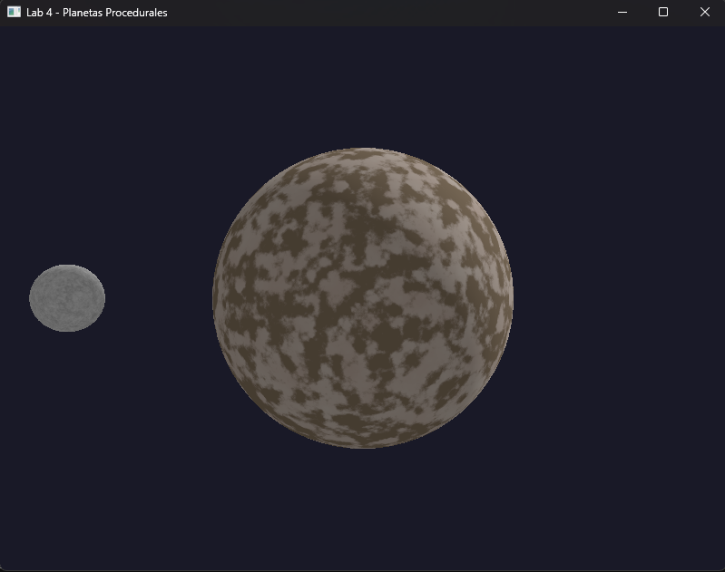
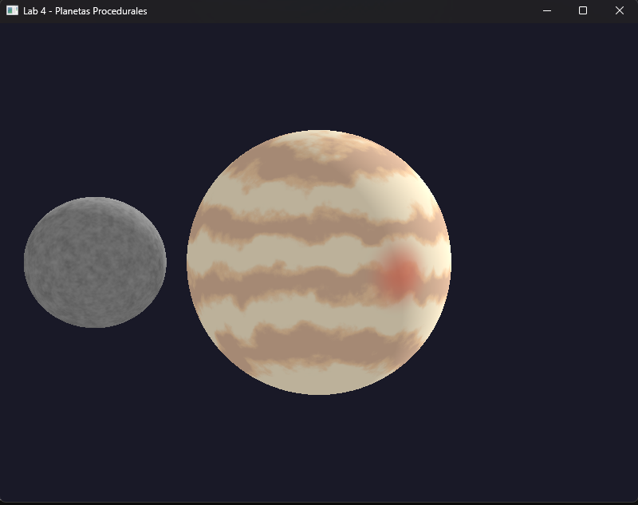
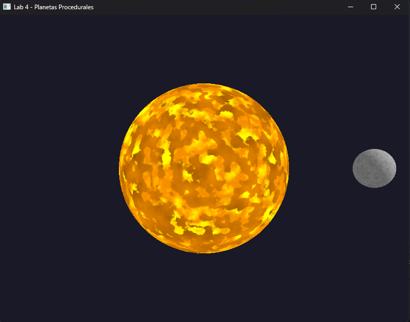
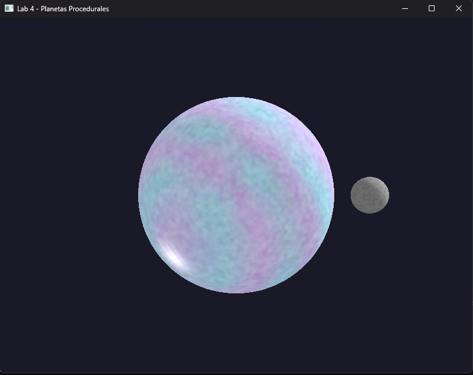
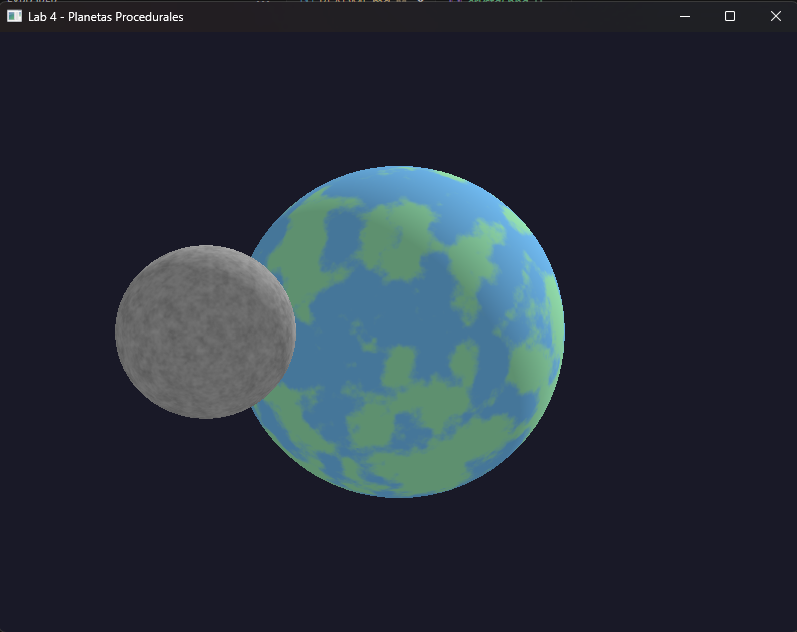

# Lab 4: Static Shaders - Planetas Procedurales

Proyecto de gráficas por computadora que genera planetas procedurales usando únicamente shaders en Rust con WGPU.

## Capturas de Pantalla

### Planeta Rocoso con Luna (Tecla 1 + M)


### Gigante Gaseoso (Tecla 2)


### Planeta de Lava con Luna (Tecla 3 + M)


### Planeta de Cristal (Tecla 4)


### Planeta oceanico (Tecla 5)



## Instalación y Ejecución

### Requisitos
- Rust 1.70 o superior
- Cargo
- GPU compatible con WGPU (Vulkan, Metal, DX12, o WebGPU)

### Ejecutar
```bash
cd Lab4
cargo run
```

## Documentación Técnica

### Uniforms

```wgsl
struct Uniforms {
    view_proj: mat4x4<f32>,    // Matriz de proyección y vista
    model: mat4x4<f32>,        // Matriz de transformación del modelo
    time: f32,                 // Tiempo para animaciones
    planet_type: u32,          // Tipo de planeta (0-4)
    render_moon: u32,          // Flag para renderizar luna
    _padding: f32,             // Padding para alineación GPU
}
```

### Shaders de Planetas

#### 1. Planeta Rocoso (`Rocoso`)
**Capas implementadas (4):**
1. Color base con variación (marrón/beige)
2. Ruido para cráteres usando FBM
3. Ruido de montañas para elevaciones
4. Iluminación direccional difusa

**Parámetros:**
- Escala de cráteres: 10.0
- Escala de montañas: 5.0
- Ambient light: 0.3
- Diffuse strength: 0.7

#### 2. Gigante Gaseoso (`Gaseoso`)
**Capas implementadas (5):**
1. Bandas horizontales basadas en coordenada Y
2. Tres colores de bandas (amarillo, naranja, marrón)
3. Turbulencias animadas con FBM
4. Gran mancha roja procedural
5. Iluminación atmosférica

**Parámetros:**
- Frecuencia de bandas: 15.0
- Velocidad de turbulencia: 0.3
- Radio de mancha: 0.3
- Intensidad de mancha: 0.8

#### 3. Planeta de Lava (`Lava`)
**Capas implementadas (5):**
1. Flujo de lava animado con FBM
2. Grietas brillantes con smoothstep
3. Gradiente de colores (oscuro → naranja → amarillo)
4. Pulsación animada con función seno
5. Emisión de luz procedural

**Parámetros:**
- Velocidad de flujo X: 0.5
- Velocidad de flujo Y: 0.3
- Frecuencia de pulsación: 2.0
- Intensidad de emisión: 1.5

#### 4. Planeta de Cristal (`Cristal`)
**Capas implementadas (6):**
1. Estructura cristalina base con FBM
2. Detalles finos con múltiples frecuencias
3. Colores iridiscentes animados (azul, púrpura, cyan, magenta)
4. Variación de ruido para imperfecciones
5. Reflexión especular con exponente 64
6. Iluminación difusa + brillo interno

**Parámetros:**
- Frecuencia base: 8.0
- Frecuencia de detalle: 16.0
- Velocidad de cambio de color: 0.5
- Intensidad especular: 0.7
- Exponente especular: 64.0

#### 5. Planeta con Oceano (`Oceánico`)
**Capas implementadas (4):**
1. Noise base con `fbm3d()` a frecuencia 4.0
2. Separación océano/tierra con `smoothstep(0.42, 0.58)`
3. Iluminación difusa más intensa (factor 0.8)
4. Colores realistas de agua y tierra


**Parámetros de planeta:**
- Escala de continentes: 4.0
- Threshold océano/tierra: 0.4-0.6

#### 6. Luna (`moon_shader`)
**Implementación en Vertex Shader:**
- Escala: 0.25 del tamaño del planeta
- Radio de órbita: 2.2 unidades
- Velocidad orbital: 1.0 rad/s

**Capas de shader (4):**
1. Colores grises base (3 tonos)
2. Cráteres con FBM a alta frecuencia (12.0)
3. Detalles de superficie fina (8.0 y 25.0)
4. Iluminación difusa consistente

**Características especiales:**
- Oclusión correcta detrás del planeta (depth buffer)
- Orbita alrededor de cualquier planeta seleccionado
- Rotación sincronizada con el tiempo global

## Estructura del Código

```
Lab4/
├── src/
│   ├── main.rs          # Lógica principal, setup de WGPU
│   └── shader.wgsl      # Vertex y Fragment shaders
├── screenshots/         # Capturas de los planetas
├── Cargo.toml           # Dependencias
└── README.md            # Este archivo
```

## Dependencias

```toml
wgpu = "0.19"           # API de gráficos moderna
winit = "0.29"          # Manejo de ventanas multi-plataforma
cgmath = "0.18"         # Matemáticas 3D (matrices, vectores)
bytemuck = "1.14"       # Conversión segura de datos a GPU
pollster = "0.3"        # Runtime async para WGPU
env_logger = "0.10"     # Sistema de logging
```
## Créditos

Desarrollado por **Milton Polanco 23471**.

**Fecha:** Octubre 30, 2025

**Tecnologías:** Rust, WGPU, WGSL, Winit, cgmath